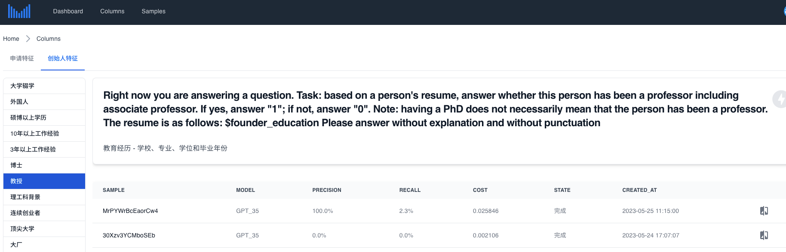

# SPA for ai-assistant(https://ai-assistant.miracleplus.com/)
Single-Page application for ai-assistant, which is a platform to manage prompt statistics(precision, recall, and etc.), the goal is to improve prompt, and use OPENAI to predict the features of applications/founders, like PhD, Prof.

## Screenshots



## Install
### Dependencies
If asdf(https://asdf-vm.com/) is your primary choice, just:
```
# make sure you've installed the specific plugins
# asdf plugin add nodejs
# asdf plugin add pnpm
# asdf plugin add just

asdf install
```

Or, install pnpm and just manually
```
npm i g pnpm
pnpm i

# MacOS
brew install just

# Archlinux
pacman -S just

# Debian/Ubuntu
git clone 'https://mpr.makedeb.org/just'
cd just
makedeb -si

# or if rust installed
cargo install just
```

## Development
You should always set the "VITE_API_PREFIX" in the .env.development file:
```
VITE_SKIP_AUTH=true # always set to true when no authorization need
VITE_API_PREFIX=http://<API_HOST>:<API_PORT>
```

Then start the server by:
```
just dev
```
The service will listen on http://0.0.0.0:5000

## Deployment
```
just deploy
```
